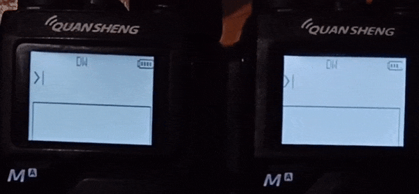
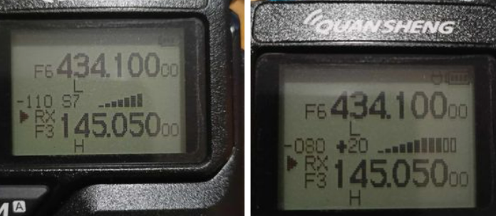
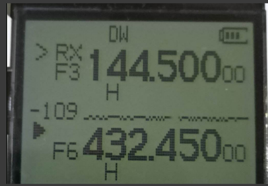
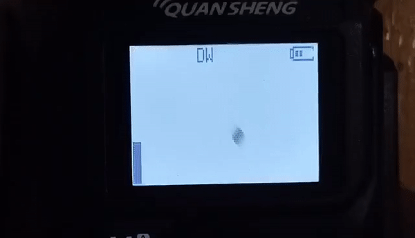
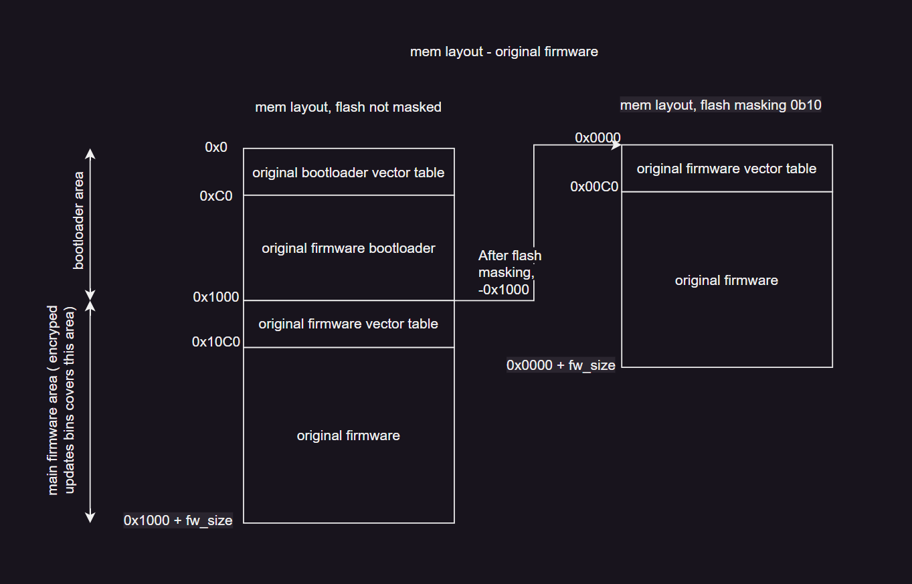
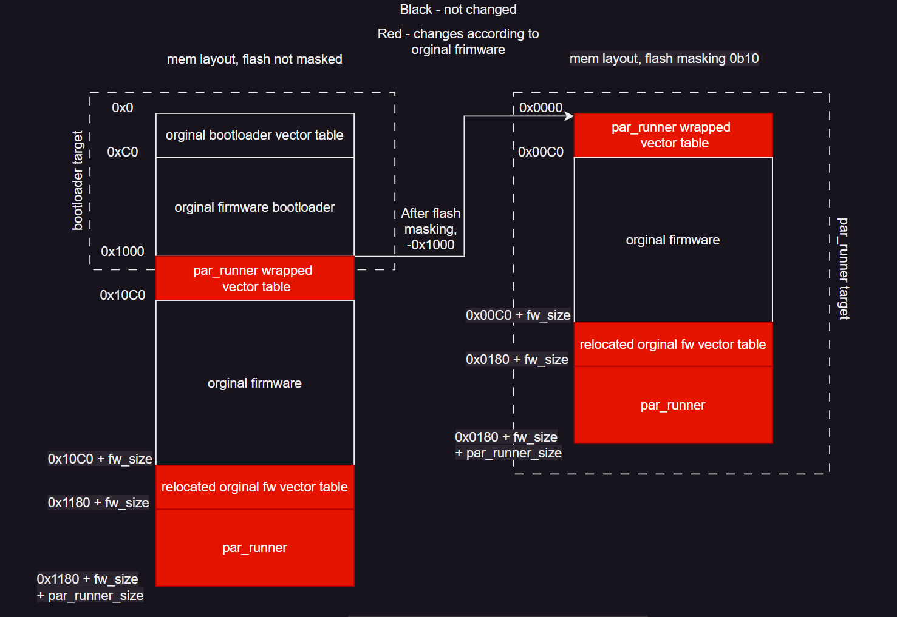

# UV_K5_playground
To support ongoing work, you can make a [donation](https://paypal.me/sq9p).  
## src/messenger 
  
AFSK messenger with T9 typing support  

* download mod [uv_k5_01_26_cold_messenger_encoded.bin](https://github.com/piotr022/UV_K5_playground/releases/latest)
* to enable messenger view press **flash light button**
* use keyboard to type message 
* press **MENU** to send message
* press **EXIT** to clear message
* if message is cleared use **EXIT** to exit messenger view  
* There is no timeout for the button. If you want to type letters located on the same button in a row, use an asterisk (*) to confirm the selected character  

## src/spectrum_fagci 

Spectrum scanner by [@fagci](https://github.com/fagci)


[more videos](https://youtube.com/playlist?list=PL67vBSofOrHMyXOEhonOzQz5gJzsZFiDq)

[download mod](https://github.com/piotr022/UV_K5_playground/releases/latest)

Features:

* no scan sound
* squelch by user input level
* 0.2 .. 3.2MHz frequency ranges
* ticks by frequency (100,500,1000KHz)
* catch signal peak frequency
* automatic frequency change step
* automatic scan step
* frequency blacklist to remove unwanted signals
* backlight control

How to start:

* set squelch level to 0 or go into monitor mode before enabling mod
* to enable spectum view press **flash light button**

How to operate:

* press **8** / **2** for zoom in / zoom out
* press and hold **3** / **9** to set squelch level
* press **5** to toggle backlight
* press **0** to remove frequency from sspectrum to scan
* press **EXIT** to disable spectrum view

## src/spectrum 
  
**update**  
Spectrum scanner. It prints a spectrum graph. Zoom in well as resolution can be controled via keyboard.

* download mod [uv_k5_01_26_spectrum_2MHz_encoded.bin](https://github.com/piotr022/UV_K5_playground/releases/latest)
* to enable spectum view press **flash light button**
* hold **up** or **down** key to change center frequency
* press **8** / **2** for zoom in / zoom out
* press **1** / **7** to increase / decrease resolution (smaller resolution == faster update rate)
* press **PTT** or **EXIT** to disable spectrum view  

## src/rssi_sbar 
  
sbar with calibrated S steps, on TX prints mic in amplitude
* download mod [uv_k5_01_26_rssi_sbar_encoded.bin](https://github.com/piotr022/UV_K5_playground/releases/latest)
* flash with original quansheng update tool  

## src/rssi_printer 
  
mod for printing rx signal level (RSSI) in numerical format, also includes small signal level chart.
### uploading to radio
* download mod [uv_k5_01_26_rssi_printer_encoded.bin](https://github.com/piotr022/UV_K5_playground/releases/latest)
* upload it through original firmware update tool:  
[Quancheng website](http://en.qsfj.com/support/downloads/3002)  

## src/pong 
  
this is useless 
* download mod [uv_k5_01_26_pong_game_encoded.bin](https://github.com/piotr022/UV_K5_playground/releases/latest)

## flash masking and memory layout
Chinese mcu DP32G030 has feature called flash masking, here is how it works:

## libs/k5_uv_system (par_runner)
The idea is to run this firmware 'parallel' with the original Quencheng firmware. This can be achieved by relocating the original vector table to the end of the original firmware, and placing a new vector table at the beginning, with entities pointing to the par_runner functions that wrap the original firmware handlers.  
Every interrupt is first processed by the par_runner handlers, which can perform some tasks, before invoking the original firmware handler
#### flash memory layout
When building the "par_runner" target automaticly "bootloader" target will be build

building UV_K5_Playground target will result in following outputs:
* target.bin / .hex - right part of image, can be used to generate encrypted firmware compatible with orginal Quescheng update tool
* bootloader.bin - stripped bootloader from orginal firmware
* target_with_bootloader.bin - complete firmware image
* target_encoded.bin - encrypted binary that can be uploaded through quancheng upload tool

To change the original firmware that will be wrapped and placed into the original firmware section, replace `./original_fw/original_fw.bin` or set the variable 
```CMakeLists.txt set(ORGINAL_FW_BIN orginal_fw.bin)```
in ./orginal_fw/CMakeLists.txt
and rebuild par_runner

## build system installation
currently tested on windows, requred:
* arm-none-eabi-gcc
* python (i have newest version)
* cmake
* ninja
* open-ocd

All folders with executables of the above programs should be added to the PATH environment variable.

After cloning repo init submodules:  
```$ git submodule update --init --recursive```  
install dependencies needed by [fw_pack.py](https://github.com/amnemonic/Quansheng_UV-K5_Firmware)  
```$ pip install pyserial```

for debugging:
* vs code
  * Cortex-Debug plugin
  * CMake plugin

### building
#### via terminal
```$ mkdir build```
```$ cd build```
```$ cmake ../ -G Ninja```  
**for all targets:**  
```$ ninja```  
**for specific target:**  
```$ ninja target_name```  
current targets: pong, rssi_printer, rssi_sbar, messenger, most_useless_mod, spectrum  
to build binary that can be uploaded by quancheng fw update tool use *_encoded* suffix for example:  
```$ ninja rssi_sbar_encoded```
###### uploading via openocd
```$ ninja rssi_sbar_flash```

#### via VS Code
Select the specific build target in the bottom bar and press build.
###### uploading
Enter the 'Run & Debug' tab, select 'kwaczek DBG', and press run.

## links
* currently firmare that is wrapped by par_runner comes from Tunas1337 mod 
k5_26_encrypted_18to1300MHz.bin [UV-K5-Modded-Firmwares](https://github.com/Tunas1337/UV-K5-Modded-Firmwares)  
* crypting/encrypting/modding py tools [amnemonic repo](https://github.com/amnemonic/Quansheng_UV-K5_Firmware)  

## Warning
I'm not responsible for radios bricked by this trojan xD
